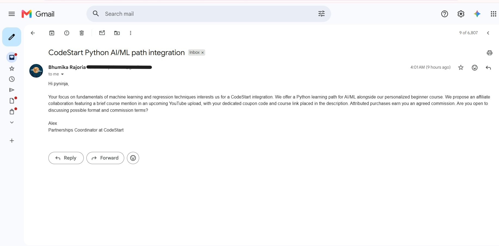

# EDXSO Automated Micro-Influencer Outreach - Assignment 1

The assignment is to build an automated system that finds suitable micro-influencers, checks them against campaign rules, collects their contact details and profile information, creates personalized messages, and shows how sending and tracking work. The final submission must include a working system, at least fifty influencer records, and clear documentation.

## Proposed solution

This Python project finds YouTube micro-influencers for a fictional beginner Python course campaign. It collects publicly available contact information, records where it was found, and creates personalized collaboration messages.

The project follows this flow for a test group of 50 creators:

- **YouTube Data API** collects channel details and recent videos.
- **Groq** identifies the channel’s niche, checks content relevance, and helps identify creator contacts.
- **Python** applies the filtering rules and calculates engagement rates.
- **SQLite** stores the collected data, results, messages, and outreach logs.
- **Gemini API** creates personalized email and Instagram DM drafts.
- **Human review** approves messages before they move to the sending stage.
- **Simulated sending** demonstrates delivery and tracking without sending real messages.
- A separate **Gmail demo** can send a real test email to an address entered by the user.

The campaign promotes **CodeStart**, a fictional personalized beginner Python course. It includes personalized coding tests and Python learning paths for data structures and algorithms (DSA) and artificial intelligence and machine learning (AI/ML).

The proposed collaboration is an **affiliate partnership**. Creators would briefly mention CodeStart in an upcoming YouTube video and add a course link and their own coupon code to the video description. They would earn an agreed commission on purchases made through their code. The promotion format and commission would be discussed with each creator.

The demo messages use the signature **Alex, Partnerships Coordinator at CodeStart**.

## Setup and requirements

### Local environment

## Setup and requirements

Use Python 3.11 or 3.12. Run these commands from the project folder to create a virtual environment and install the required libraries:

```powershell
uv venv .venv
uv pip install --python .\.venv\Scripts\python.exe -r requirements.txt
```

If you do not use `uv`, run:

```powershell
py -3 -m venv .venv
.\.venv\Scripts\python.exe -m pip install -r requirements.txt
```

You do not need to activate the virtual environment because the commands use its Python interpreter directly.

### API keys and local configuration

Create a `.env` file in the project folder. Copy the contents of `.env.example` into it, then replace the API key placeholders with your own keys.

Supply these values privately:

```dotenv
YOUTUBE_API_KEY=your_youtube_key
GROQ_API_KEY=your_groq_key
GEMINI_API_KEY=your_gemini_key
```

- **YouTube:** create/select a Google Cloud project, enable YouTube Data API v3, and create a key for the public metadata requests used here. See [YouTube setup](https://developers.google.com/youtube/v3/getting-started).
- **Groq:** create a key through the [Groq console](https://console.groq.com/keys). Classification and enrichment use this key.
- **Gemini:** create/manage a key in Google AI Studio following the [Gemini API key guide](https://ai.google.dev/gemini-api/docs/api-key). Personalization uses this key.
- **Gmail, optional:** uses local OAuth files, not a Gmail API key; see the separate demo instructions below.

`config.py` explicitly loads the project-root `.env` at stage entry points. Existing process environment variables take precedence, including empty variables; values are not interpolated from other variables. Importing modules does not load `.env`, open/migrate a database, make API calls or send messages.

Supported settings in `.env.example` retain these defaults:

```ini
DISCOVERY_TARGET=50
RECENT_VIDEO_LIMIT=10
MIN_SUBSCRIBERS=5000
MAX_SUBSCRIBERS=100000
MAX_SEARCH_REQUESTS=12
MAX_PLAYLIST_PAGES_PER_CHANNEL=3
REQUEST_TIMEOUT_SECONDS=30
DATABASE_PATH=data/outreach.db
```

Save the file, then check the local configuration:

```powershell
.\.venv\Scripts\python.exe config.py
```

This checks your local YouTube settings without displaying the API key. It does not make an API request or check the Groq and Gemini keys.
**Models used:** Groq uses `openai/gpt-oss-120b` for classification and enrichment. Gemini uses `gemini-3.8-flash` for message personalization.

## Architecture and filtering

## Project architecture


The main workflow runs step by step. Each file has a specific role:

- **`config.py`** loads local settings, API keys, and the database path.
- **`schemas.py`** checks that records follow the required format.
- **`database.py`** stores records and their history, links related data, and supports older saved records.
- **`discovery.py`** searches YouTube, removes duplicate channels, and checks subscriber counts. It aims to find 50 creators within the subscriber range. These creators still need to pass the later filters.
- **`collection.py`** collects each creator’s ten most recent public videos, including Shorts. It saves titles, descriptions, statistics, and any collection issues. Live and upcoming videos are excluded. Subscriber counts are taken from saved data.
- **`classification.py`** uses Groq to identify the niche from the channel description and check Python relevance from the ten video titles. It does not use video descriptions.
- **`filtering.py`** applies the campaign rules to saved data and calculates engagement rates. It makes no API calls.
- **`enrichment.py`** processes creators who passed filtering. It checks channel and saved video descriptions, then follows relevant public links to find contact details. Python removes duplicate candidates and saves their sources before Groq checks whether they belong to the creator. Selenium is optional.
- **`personalization.py`** uses the creator’s name, niche, content themes, and campaign details to generate an email and Instagram DM. It does not use individual video titles or descriptions. Both drafts are created even when contact details are missing.
- **`review.py`** records human approval or rejection separately for emails and DMs. It saves the reviewer, review time, and rejection reason. Approval applies to the exact saved message and recipient.
- **`sending.py`** simulates sending and records the result. It prevents duplicate simulations.
- **`gmail_demo.py`** separately sends an optional real test email to an address entered by the user. It keeps its own sending log and prevents duplicate test sends.
- **`export_results.py`** reads the database and exports the full creator dataset, saved messages, and separate outreach trackers. It does not change the database.
- **`tests/verify_offline.py`** runs offline checks for the workflow, settings, and duplicate prevention without making real API calls or sending messages.

Filtering policy:

1. Description niche: TECHNOLOGY passes; OTHER fails; UNCLEAR/missing evidence requires review.
2. Relevance: at least 5 of 10 MATCH/RELATED titles passes. Below five, enough UNCLEAR titles to potentially reach five requires review; otherwise fails.
3. Saved subscribers: 5,000–100,000 inclusive; missing/hidden counts require review.
4. Custom engagement: all ten likes/comments inputs and a positive known subscriber denominator are required. Missing values are not replaced with zero. PASS requires **strictly greater than 1.4%**; exactly 1.4% fails.

```text
engagement_percent = 100 × sum(likes + comments across 10 videos)
                         / (10 × saved subscriber_count)
```

Views are collected but excluded from this formula. Any criterion FAIL makes the overall result FAIL; otherwise any unresolved criterion makes it NEEDS_REVIEW; all PASS makes it PASS. No demographic, geography, language or weighted-score filters are added.

## Run the project step by step

Run these commands from the project folder in the same PowerShell terminal.

- **API usage:** Discovery, collection, classification, enrichment, and personalization may use API quota.
- **Preview:** Preview commands show what will be processed without making API requests or saving changes.

### 1. Prepare the database

For a new installation, initialize the database:

```powershell
.\.venv\Scripts\python.exe database.py
```

- **Existing database:** Keep it when rerunning the project. It contains saved results and the logs used to **prevent duplicate outreach**.

### 2. Discover creators and collect their videos

```powershell
.\.venv\Scripts\python.exe discovery.py
.\.venv\Scripts\python.exe collection.py --limit 50
```

- **Discovery:** Finds creators within the subscriber range and saves them.
- **Collection:** Collects ten recent videos for each selected creator.
- **Limit:** Use `--limit 50` for the assignment. Collection defaults to five creators if this option is omitted.
- **Collection summary:** Check for creators with missing or incomplete video samples.

Collection prints a **new collection run ID**. Copy that ID and enter it here:

```powershell
$runId = Read-Host "Paste the collection run ID"
```

- **Same run ID:** Use this ID for every remaining step.
- **New collection:** Running collection again creates another run ID.
- **Saved data:** Runs identify the selected creators and videos. Their saved metadata can be updated by later collection runs.

### 3. Classify niche and content relevance

```powershell
.\.venv\Scripts\python.exe classification.py --preview --run-id $runId --limit 50
.\.venv\Scripts\python.exe classification.py --run-id $runId --limit 50
```

- **Preview:** Shows which samples are ready and which classifications can be reused.
- **Classification:** Groq checks the niche from the channel description and Python relevance from the ten video titles.
- **Reuse:** Matching saved classifications are reused without another API request.

### 4. Apply the filtering rules

```powershell
.\.venv\Scripts\python.exe filtering.py --preview --run-id $runId --limit 50
.\.venv\Scripts\python.exe filtering.py --run-id $runId --limit 50
```

- **Filtering:** Checks niche, content relevance, subscriber count, and engagement rate.
- **Results:** Saves `PASS`, `FAIL`, or `NEEDS_REVIEW`, with reasons.

### 5. Enrich profiles that passed

```powershell
.\.venv\Scripts\python.exe enrichment.py --preview --run-id $runId --limit 50
.\.venv\Scripts\python.exe enrichment.py --run-id $runId --limit 50
```
To enable optional Selenium rendering, use this command instead of the second command above:

```powershell
.\.venv\Scripts\python.exe enrichment.py --run-id $runId --limit 50 --selenium
```

- **Selected profiles:** Only creators with a saved `PASS` result are enriched.
- **Contact search:** Checks channel and saved video descriptions, then relevant public websites and profile links.
- **Extra sources:** You can provide known creator-related pages using `--source-url CHANNEL_ID=URL`, up to two per creator.
- **Contact rules:** Emails are fetched from sources, not guessed. Sponsor and unrelated contacts are excluded.
- **Access limits:** The project does not bypass login pages or CAPTCHAs.
- **Missing information:** `NOT_ENRICHED` means enrichment has not been performed. `NOT_FOUND` means the search found no suitable email. Ambiguous or unfinished searches remain marked for review.

### 6. Generate email and Instagram DM drafts

```powershell
.\.venv\Scripts\python.exe personalization.py --preview --run-id $runId --limit 50
.\.venv\Scripts\python.exe personalization.py --run-id $runId --limit 50
```

- **Email:** Generates a subject and a 60–90-word body, including the greeting and signature.
- **Instagram DM:** Generates a 15–30-word message.
- **Personalization:** Uses the creator’s name, niche, content themes, and CodeStart campaign details.
- **Writing rules:** Does not claim that the sender watched or loved individual videos, or invent audience details, links, coupon codes, prices, or commission percentages.
- **Missing contacts:** Both drafts are generated even when an email or Instagram profile is unavailable.

### 7. Read and approve the drafts (Optional)

Show the saved drafts:

```powershell
.\.venv\Scripts\python.exe review.py --preview --run-id $runId --limit 50
```

After reading a draft, enter its message ID and your reviewer name:

```powershell
$messageId = Read-Host "Paste the message ID you reviewed"
$reviewer = Read-Host "Enter your reviewer name"
```

Approve its email:

```powershell
.\.venv\Scripts\python.exe review.py --run-id $runId --approve $messageId --medium email --reviewer $reviewer
```

If you also want to approve its Instagram DM, run:

```powershell
.\.venv\Scripts\python.exe review.py --run-id $runId --approve $messageId --medium dm --reviewer $reviewer
```

To reject the email instead:

```powershell
.\.venv\Scripts\python.exe review.py --run-id $runId --reject $messageId --medium email --reviewer $reviewer --reason "Your reason"
```

- **Separate approvals:** Approving an email does not approve its DM.
- **Exact draft:** Approval applies to the saved message and recipient. Changed messages or recipient details require another review.
- **Missing recipient:** Approval does not supply a missing email or Instagram profile.
- **Other creators:** Repeat this step using each draft’s message ID.
- **Review only:** This step does not send messages, recheck email validity, or call an LLM.

### 8. Simulate sending and view the tracker

```powershell
.\.venv\Scripts\python.exe sending.py --preview --run-id $runId --limit 50
.\.venv\Scripts\python.exe sending.py --simulate --run-id $runId --limit 50
.\.venv\Scripts\python.exe sending.py --tracker --run-id $runId
```

- **Readiness:** A message needs approval and an available recipient before it can be simulated.
- **Simulation:** Records `SIMULATED` with **Sent: No** because no real message is sent.
- **Duplicate prevention:** Prevents another simulation for the same creator, campaign, and message type, even across new runs.
- **Earlier simulations:** Remain linked to their original run. Later duplicate attempts show `SKIPPED_DUPLICATE`.
- **Blocked records:** Can be updated when approval or recipient information becomes available.
- **Instagram:** DM delivery is simulated only.
- **Real email test:** The optional Gmail demo runs separately.

### 9. Export the results

```powershell
.\.venv\Scripts\python.exe export_results.py --run-id $runId --output-dir "exports-$runId"
```

The output folder contains:

- **`influencers.csv`:** All creators in the selected collection run, with their available data and filtering results.
- **`shortlisted_profiles.json`:** Enriched profiles for shortlisted creators.
- **`personalized_messages.md`:** Saved email and Instagram DM drafts.
- **`simulation_tracker.csv`:** Simulation records.
- **`gmail_test_tracker.csv`:** Separate Gmail test records.
  
- **Saved results:** Exports use the actual saved values, messages, and missing-data statuses.
- **Read-only:** Exporting does not change the database, call APIs, or send messages.


### Optional: send a real Gmail test email

The Gmail demo is separate from simulated sending. It is **disabled by default** because this line at the end of `gmail_demo.py` is commented out:

```python
# raise SystemExit(main())
```

Follow these steps if you want to test real email sending:

1. **Set up Gmail access**
   - Enable the Gmail API in your Google Cloud project.
   - Configure the OAuth consent screen and add your Google account as a test user.
   - Create a **Desktop app OAuth client**.
   - Download its JSON file and save it in the project folder as **`credentials.json`**.
   - See [Google’s Gmail Python setup](https://developers.google.com/workspace/gmail/api/quickstart/python). Keep this project’s **`gmail.send`** permission; do not replace it with the quickstart’s mail-reading permission.

2. **Enable the demo**
   - Open `gmail_demo.py`.
   - Uncomment the line at the end:

   ```python
   raise SystemExit(main())
   ```

3. **Choose an approved draft**
   - Use an email draft approved through `review.py`.
   - Its creator must have a saved **`FOUND`** email contact.
   - Set `$messageId` to that draft’s message ID.
   - The demo sends the saved message to **your test address**, not the creator’s address.

4. **Enter your test address and authorize Gmail**

   ```powershell
   $testRecipient = Read-Host "Enter your own test email address"
   .\.venv\Scripts\python.exe gmail_demo.py --authorize
   ```

   Complete the Google sign-in and permission steps in your browser.

5. **Preview the email**

   ```powershell
   .\.venv\Scripts\python.exe gmail_demo.py --preview --run-id $runId --message-id $messageId --test-recipient $testRecipient
   ```

6. **Send the test email**

   ```powershell
   .\.venv\Scripts\python.exe gmail_demo.py --send-test --run-id $runId --message-id $messageId --test-recipient $testRecipient
   ```

7. **View the sending record**

   ```powershell
   .\.venv\Scripts\python.exe gmail_demo.py --tracker
   ```

8. **Disable the demo after testing**
   - Comment out the main line again:

   ```python
   # raise SystemExit(main())
   ```

Important details:

- **Separate logs:** Gmail tests and simulations use separate logs in the same database. Neither runs the other.
- **Duplicate prevention:** The same creator, campaign, and test address cannot be sent again automatically.
- **Uncertain results:** An unfinished or uncertain send remains blocked from automatic retry to avoid duplicate emails.
- **`SENT` status:** Means Gmail accepted the email and returned a message ID. It does not confirm inbox delivery or that the email was opened.

  

## Important observed results

Results
The project completed a live run, and the final outputs are available in the export folder.
- Creators collected: 50, with ten videos each.
- Classification: 9 new classifications saved and 41 saved classifications reused.
- Filtering: 3 PASS, 44 FAIL, and 3 NEEDS_REVIEW.
- Shortlisted creators: Harry Connor AI, The Programmers Realm, and pyninja.
- Profile enrichment: All three shortlisted profiles were enriched. One email was found; the other two were marked Not Found.
- Personalization: Three email drafts and three Instagram DM drafts were saved.
- Review: The pyninja email draft was approved.
- Email simulation: The pyninja email was successfully simulated in an earlier run. The latest run skipped it to prevent duplicate outreach.
- Gmail test: The pyninja draft was successfully sent to the user’s test email address through Gmail, and receipt was confirmed. It was not sent to the creator.
  
View the final outputs
Open the export folder to view the assignment outputs:
- influencers.csv: The 50-creator dataset and filtering results.
- shortlisted_profiles.json: Enriched profiles for the shortlisted creators.
- personalized_messages.md: Personalized email pitches and Instagram DMs.
- simulation_tracker.csv: Simulation records and statuses.
- gmail_test_tracker.csv: Gmail test records, if available.
Open the CSV files in Excel or another spreadsheet application to view them as tables. To preview the personalized messages in VS Code, open personalized_messages.md.

## Limitations

- **Custom engagement formula:** The engagement formula and threshold above 1.4% are project choices as per custom formula because no standard documentation was available, not a standard YouTube measure. Views are not included. Newer videos may have fewer likes and comments because they have been available for less time.
- **Older data:** The project does not automatically reject old data or refresh subscriber counts during video collection. Later collections can update saved metadata, so earlier runs do not preserve a separate copy of every observation.
- **API limits and failures:** Groq and Gemini may return quota or service errors. Groq classification can wait up to 180 seconds for a rate-limit retry. **Enrichment allows up to three LLM requests per creator** so that unnecessary routes to LLM are not made. Gemini personalization allows up to three requests, including at most one correction, with planned waits of no more than 10 seconds. **API responses can take longer**.
- **Contact availability:** Some emails are hidden behind login pages or CAPTCHA checks. The crawler cannot guarantee finding every creator’s email. Missing emails are marked **Not Found**, while blocked or unfinished searches remain marked for review.
- **Email verification:** Finding an email in a source does not prove that the inbox works or belongs to the creator. The project checks source and contact context, but does not verify email deliverability.
- **Sending scope:** Instagram DM delivery is simulated only. **Real Gmail sending is demonstrated separately by sending an approved draft to a test address entered by the user, rather than to the creator.**
