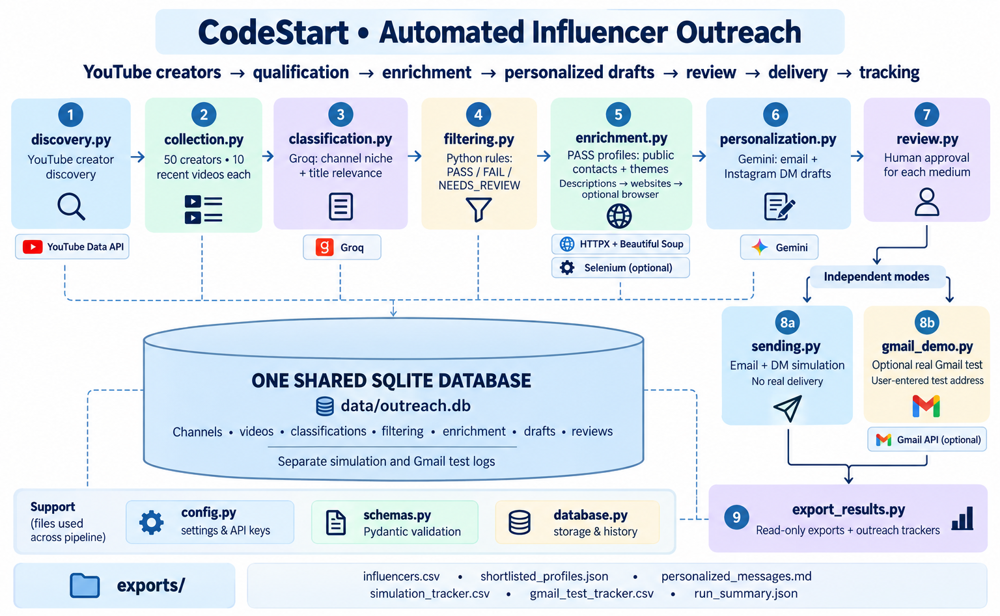

# EDXSO Automated Micro-Influencer Outreach

The assignment is to build an automated system that finds suitable micro-influencers, checks them against campaign rules, collects their contact details and profile information, creates personalized messages, and shows how sending and tracking work. The final submission must include a working system, at least fifty influencer records, and clear documentation.

## Proposed solution

This Python project finds YouTube micro-influencers for a fictional beginner Python course campaign. It collects publicly available contact information, records where it was found, and creates personalized collaboration messages.

The project follows this flow for a test group of 50 creators:

- **YouTube Data API** collects channel details and recent videos.
- **Groq** identifies the channel’s niche, checks content relevance, and helps identify creator contacts.
- **Python** applies the filtering rules and calculates engagement rates.
- **SQLite** stores the collected data, results, messages, and outreach logs.
- **Gemini API** creates personalized email and Instagram DM drafts.
- **Human review** approves messages before they move to the sending stage.
- **Simulated sending** demonstrates delivery and tracking without sending real messages.
- A separate **Gmail demo** can send a real test email to an address entered by the user.

The campaign promotes **CodeStart**, a fictional personalized beginner Python course. It includes personalized coding tests and Python learning paths for data structures and algorithms (DSA) and artificial intelligence and machine learning (AI/ML).

The proposed collaboration is an **affiliate partnership**. Creators would briefly mention CodeStart in an upcoming YouTube video and add a course link and their own coupon code to the video description. They would earn an agreed commission on purchases made through their code. The promotion format and commission would be discussed with each creator.

The demo messages use the signature **Alex, Partnerships Coordinator at CodeStart**.

## Setup and requirements

### Local environment

## Setup and requirements

Use Python 3.11 or 3.12. Run these commands from the project folder to create a virtual environment and install the required libraries:

```powershell
uv venv .venv
uv pip install --python .\.venv\Scripts\python.exe -r requirements.txt
```

If you do not use `uv`, run:

```powershell
py -3 -m venv .venv
.\.venv\Scripts\python.exe -m pip install -r requirements.txt
```

You do not need to activate the virtual environment because the commands use its Python interpreter directly.

### API keys and local configuration

Create a `.env` file in the project folder. Copy the contents of `.env.example` into it, then replace the API key placeholders with your own keys.

Supply these values privately:

```dotenv
YOUTUBE_API_KEY=your_youtube_key
GROQ_API_KEY=your_groq_key
GEMINI_API_KEY=your_gemini_key
```

- **YouTube:** create/select a Google Cloud project, enable YouTube Data API v3, and create a key for the public metadata requests used here. See [YouTube setup](https://developers.google.com/youtube/v3/getting-started).
- **Groq:** create a key through the [Groq console](https://console.groq.com/keys). Classification and enrichment use this key.
- **Gemini:** create/manage a key in Google AI Studio following the [Gemini API key guide](https://ai.google.dev/gemini-api/docs/api-key). Personalization uses this key.
- **Gmail, optional:** uses local OAuth files, not a Gmail API key; see the separate demo instructions below.

`config.py` explicitly loads the project-root `.env` at stage entry points. Existing process environment variables take precedence, including empty variables; values are not interpolated from other variables. Importing modules does not load `.env`, open/migrate a database, make API calls or send messages.

Supported settings in `.env.example` retain these defaults:

```ini
DISCOVERY_TARGET=50
RECENT_VIDEO_LIMIT=10
MIN_SUBSCRIBERS=5000
MAX_SUBSCRIBERS=100000
MAX_SEARCH_REQUESTS=12
MAX_PLAYLIST_PAGES_PER_CHANNEL=3
REQUEST_TIMEOUT_SECONDS=30
DATABASE_PATH=data/outreach.db
```

Save the file, then check the local configuration:

```powershell
.\.venv\Scripts\python.exe config.py
```

This checks your local YouTube settings without displaying the API key. It does not make an API request or check the Groq and Gemini keys.
**Models used:** Groq uses `openai/gpt-oss-120b` for classification and enrichment. Gemini uses `gemini-3.8-flash` for message personalization.

## Architecture and filtering

## Project architecture



flowchart TD
    A[YouTube discovery] --> B[Video collection and named cohort]
    B --> C[Groq description niche and title relevance]
    C --> D[Deterministic Python filtering]
    D --> E[PASS profiles: public contact enrichment]
    E --> F[Gemini profile-theme email and DM drafts]
    F --> G[Separate human email and DM review]
    G --> H[Simulation only]
    G --> I[Optional explicit Gmail test]
    H --> J[Read-only exports and separate trackers]
    I --> J
    K[(One local SQLite database)] --- B
    K --- D
    K --- E
    K --- F
    K --- G
    K --- J

Modules are executed sequentially, not by an automatic orchestrator:

- `config.py`: shared local environment/database helpers and YouTube settings.
- `schemas.py` / `database.py`: validated records, linked samples, transactions, versioned history and compatible legacy readers.
- `discovery.py`: YouTube-only search, deduplication and inclusive subscriber eligibility. Missing/hidden counts stay unknown. The default target is 50 size-eligible creators, not 50 final PASS creators.
- `collection.py`: latest ten public, already-published non-live uploads per creator; normal uploads and Shorts share selection. Exclusions and uncertain/partial statuses are stored with the ordered source IDs. Stats and descriptions are fetched here. Selection uses saved eligible creators in channel-ID order and does not refresh subscriber counts.
- `classification.py`: Groq niche judgment from channel description only, and relevance from the ten titles only. Video descriptions are not classification input.
- `filtering.py`: calculation from saved records; no network calls.
- `enrichment.py`: current saved PASS profiles only; literal candidates, evidence and deduplicated occurrences are persisted before batched Groq ownership judgments. Uses channel descriptions and saved video-description contact evidence, known public sources and creator-linked websites, with bounded optional browser rendering and already-discovered Instagram routes.
- `personalization.py`: creator name, niche, profile themes and campaign facts only; no video-title/description text is sent for drafting. Produces both drafts even when contacts are missing.
- `review.py`: separate human email/DM decisions, reviewer/time/rejection reason, bound to exact saved text and recipients.
- `sending.py` / `gmail_demo.py`: independent simulation and Gmail-test layers, with separate persistent logs.
- `export_results.py`: one read-only database snapshot, full cohort dataset, exact saved messages and separate trackers.
- `tests/verify_offline.py`: existing self-checks plus focused configuration, import-boundary and reservation checks.

Filtering policy:

1. Description niche: TECHNOLOGY passes; OTHER fails; UNCLEAR/missing evidence requires review.
2. Relevance: at least 5 of 10 MATCH/RELATED titles passes. Below five, enough UNCLEAR titles to potentially reach five requires review; otherwise fails.
3. Saved subscribers: 5,000–100,000 inclusive; missing/hidden counts require review.
4. Custom engagement: all ten likes/comments inputs and a positive known subscriber denominator are required. Missing values are not replaced with zero. PASS requires **strictly greater than 1.4%**; exactly 1.4% fails.

```text
engagement_percent = 100 × sum(likes + comments across 10 videos)
                         / (10 × saved subscriber_count)
```

Views are collected but excluded from this formula. Any criterion FAIL makes the overall result FAIL; otherwise any unresolved criterion makes it NEEDS_REVIEW; all PASS makes it PASS. No demographic, geography, language or weighted-score filters are added.

## Run the project step by step

Run commands from the project root. Provider stages consume quota; previews are read-only. Output can be retained with `2>&1 | Tee-Object -FilePath stage.log` without rerunning a stage merely to recover terminal scrollback. Logs may contain contacts and should stay local.

### 1. Verify offline and initialize local storage

```powershell
.\.venv\Scripts\python.exe tests\verify_offline.py
# On a new checkout only: initialize the local database.
.\.venv\Scripts\python.exe database.py
```

The basic runner executes 20 groups with temporary/synthetic data and mocked Gmail. No keys are required. Every existing module `--self-check` entry point remains supported. `database.py` is an initialization/migration command, not a read-only preview; an existing project already has its database. Do not delete or empty a working DB to prepare a repository.

### 2. Discover and collect

```powershell
.\.venv\Scripts\python.exe discovery.py
.\.venv\Scripts\python.exe collection.py --limit 50
```

Collection defaults to five creators if `--limit` is omitted; specify 50 for the test target. It selects saved eligible creators, which may include earlier discoveries. Read the summary for shortfalls/incomplete samples.

Copy the **new** `Collection run:` ID printed by collection:

```powershell
$runId = Read-Host "Paste the collection run ID"
```

Use that same ID for all remaining stages. Repeating collection creates another run. Saved metadata is current shared data, not a frozen per-run snapshot.

### 3. Classify

```powershell
.\.venv\Scripts\python.exe classification.py --preview --run-id $runId --limit 50
.\.venv\Scripts\python.exe classification.py --run-id $runId --limit 50
```

The preview checks sample readiness and compatible cached classifications without requests/writes. The second command reuses compatible judgments and calls Groq for missing ones. Prompt `classification_v4` and criteria `python_course_v2` remain versioned.

### 4. Filter

```powershell
.\.venv\Scripts\python.exe filtering.py --preview --run-id $runId --limit 50
.\.venv\Scripts\python.exe filtering.py --run-id $runId --limit 50
```

The second command saves deterministic decisions and reasons. Both commands use saved metadata only.

### 5. Enrich PASS profiles

```powershell
.\.venv\Scripts\python.exe enrichment.py --preview --run-id $runId --limit 50
.\.venv\Scripts\python.exe enrichment.py --run-id $runId --limit 50
```

Optional public-website rendering:

```powershell
.\.venv\Scripts\python.exe enrichment.py --run-id $runId --limit 50 --selenium
```

Known creator-related public HTML sources can be supplied with repeated `--source-url CHANNEL_ID=URL` arguments (at most two per creator). Contacts are not guessed from names/domains. Sponsor/unrelated addresses are excluded; ambiguous and unfinished searches retain their statuses. There are no login/CAPTCHA bypasses. NOT_ENRICHED means the stage was not performed for that profile; NOT_FOUND means a saved enrichment search found no selected email.

### 6. Generate both drafts

```powershell
.\.venv\Scripts\python.exe personalization.py --preview --run-id $runId --limit 50
.\.venv\Scripts\python.exe personalization.py --run-id $runId --limit 50
```

Gemini produces an email subject, a 60–90-word email body including greeting/signature, and a 15–30-word Instagram DM. Both drafts use profile themes; no individual-video comments, watched/loved claims, invented audience traits or actual links/codes/prices/commission percentages are allowed. Three prompt examples are illustrations. Cached compatible drafts can be reused, and missing contacts do not prevent drafting.

### 7. Review the exact saved text

```powershell
.\.venv\Scripts\python.exe review.py --preview --run-id $runId --limit 50
$messageId = Read-Host "Paste the message ID you reviewed"
$reviewer = Read-Host "Enter your actual reviewer name"
.\.venv\Scripts\python.exe review.py --run-id $runId --approve $messageId --medium email --reviewer $reviewer
```

DM approval is a separate decision, if desired:

```powershell
.\.venv\Scripts\python.exe review.py --run-id $runId --approve $messageId --medium dm --reviewer $reviewer
```

To reject instead, use `--reject $messageId --medium email --reviewer $reviewer --reason "Your reason"`. Changed text/recipient state or regenerated drafts need their own exact approval. Approval cannot create a missing recipient. Review and sending do not revalidate creator emails or make LLM calls.

### 8. Simulate and inspect tracking

```powershell
.\.venv\Scripts\python.exe sending.py --preview --run-id $runId --limit 50
.\.venv\Scripts\python.exe sending.py --simulate --run-id $runId --limit 50
.\.venv\Scripts\python.exe sending.py --tracker --run-id $runId
```

Simulation always means **Sent: No**. Missing recipients/reviews block readiness. Duplicate prevention uses creator + campaign + medium, surviving new runs and regenerated drafts. A prior successful simulation stays associated with its original run; later skips are displayed, not appended as new success rows. Blocked rows can be updated when their readiness changes. Instagram sending remains simulated only.

### 9. Export saved results

```powershell
.\.venv\Scripts\python.exe export_results.py --run-id $runId --output-dir "exports-$runId"
```

The six outputs are `influencers.csv`, `shortlisted_profiles.json`, `personalized_messages.md`, `simulation_tracker.csv`, `gmail_test_tracker.csv`, and `run_summary.json`. They retain all cohort creators, actual values/reasons/missing statuses, exact saved messages and separate trackers. CSV formula escaping affects presentation only. Export does not alter the database, call providers or send messages. Trackers are scoped to the selected run; earlier attempts can still block duplicates while absent from that run's export.

### Optional: independent Gmail test

This is not required for the simulation workflow. It is **disabled by default** through the commented `raise SystemExit(main())` invocation at the end of `gmail_demo.py`.

If you explicitly choose to test real Gmail:

1. Enable the Gmail API in your Google Cloud project and configure the OAuth consent/access settings for your account. Create a Desktop OAuth client; save its JSON locally as `credentials.json`. See [Google's Gmail Python setup](https://developers.google.com/workspace/gmail/api/quickstart/python). This project's scope is **gmail.send only**; do not copy the quickstart's different mail-reading scope into this project.
2. Manually uncomment only the main invocation in `gmail_demo.py` for your opted-in test session.
3. Choose a current approved email draft with a saved FOUND creator contact. The demo redirects that approved text to your explicit test address; it does not automatically send to the creator.
4. Run the following only after opting in:

```powershell
$testRecipient = Read-Host "Enter your own test email address"
.\.venv\Scripts\python.exe gmail_demo.py --authorize
.\.venv\Scripts\python.exe gmail_demo.py --preview --run-id $runId --message-id $messageId --test-recipient $testRecipient
# Real send to the explicitly supplied test address:
.\.venv\Scripts\python.exe gmail_demo.py --send-test --run-id $runId --message-id $messageId --test-recipient $testRecipient
.\.venv\Scripts\python.exe gmail_demo.py --tracker
```

Authorization creates a private local `token.json`. Restore the commented main invocation after testing so the demo stays disabled by default. Simulation never triggers this demo and this demo never triggers simulation.

Gmail duplicate keys are creator + campaign + test-recipient. A committed IN_PROGRESS reservation precedes the send; uncertain outcomes become UNKNOWN and are not automatically retried or cleared. SENT requires a provider message ID and means API acceptance, not proof of inbox placement/open. Changing test recipient/campaign intentionally creates another key.

## Important observed results

On 2026-10-04, the user executed the updated project locally with Python 3.11.15. The consolidated configuration and all **20 basic offline check groups passed**. Earlier cleanup verification on Python 3.12.14 included 21 groups with compatibility checks against a disposable copy of the supplied historical database, plus each existing module's CLI self-check. These offline results are separate from the user-run live results.

Latest live collection cohort: `7d1ab952fad4461cbaa1c26a3bb3cc32`.

- 50 creators attempted; all 50 had complete ten-video samples (500 linked sample entries).
- Local accumulated storage after collection contained 383 channels and 779 unique videos across history; these are not all new or shortlisted creators.
- Classification saved nine new judgments and reused 41 compatible judgments; zero skipped.
- Filtering: **3 PASS, 44 FAIL, 3 NEEDS_REVIEW**.
- PASS creators: Harry Connor AI, The Programmers Realm and pyninja.
- Three enriched profiles; one selected source-backed email. Harry Connor AI and The Programmers Realm had NOT_FOUND email status.
- Three saved email/DM draft pairs; no failed or skipped personalization profiles.
- The new pyninja email was explicitly approved. Its earlier successful simulation prevented a duplicate simulation for the new run.
- Latest run export recorded five BLOCKED_NO_RECIPIENT rows, no new successful simulation and no Gmail-test attempt for that run. Export reported zero database writes and zero network requests.

An earlier cohort (`c67d6cab516a4c3bb7bfc472dddaeac6`) retained one successful email simulation and a separate Gmail SENT test. The user historically confirmed receipt of that test email. That evidence is not a new Gmail test of the final consolidated configuration, nor influencer delivery/open tracking. No real creator outreach or automated Instagram delivery was performed in the latest run.

These are observed checkpoint results, not guaranteed outputs for a new clone or future API responses. Export folders are included in Git so reviewers can inspect the saved dataset, messages and trackers. The local database and authentication artifacts remain excluded; a fresh clone can inspect the exports but does not have the persisted review/send history needed to resume that database. Disclose any privacy masking in a public export copy and preserve the original local evidence.

## Limitations

- **Engagement is a self-chosen project metric.** The formula and strict >1.4% threshold were chosen for this prototype; they are not a universally supplied YouTube or industry engagement standard. Views are excluded, observation times vary, and newer uploads may have had less time to accumulate interactions.
- **Derived-data permission is not established.** Filtering records explicitly retain NOT_ESTABLISHED for the derived metric's data-use permission. This disclosure does not establish legal/platform compliance.
- **No automatic freshness cutoff or subscriber refresh at collection.** Current channel/video metadata may overwrite earlier observations; sample IDs/results are not per-run metadata snapshots. Old cohorts can therefore reference newer current metadata, and changed inputs can require new classification/filtering.
- **Provider quotas/errors remain possible.** Groq classification/enrichment share pacing with a bounded rate-limit wait of up to 180 seconds. Enrichment has at most three LLM network requests per creator including retries, with batched judgments rather than a per-page LLM loop. Gemini personalization has one shared three-request cap, at most one correction and intentional waits no longer than ten seconds; longer indicated delays are deferred. HTTP response time is separate. Ten seconds is not a global latency bound.
